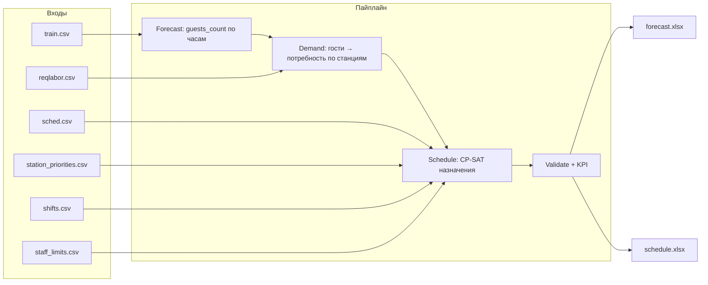

# Архитектура решения: прогноз гостей и расписание персонала

Документ фиксирует концепцию проекта по ТЗ (ресторан: прогноз спроса → потребность в людях → оптимальное назначение сотрудников).

## Суть задачи

Двухэтапное решение:

1. **Прогноз гостей** по часам на 7 дней вперёд.
2. **Автоматическое составление расписания** сотрудников по станциям и часам на основе прогноза и ограничений.

Связка: **прогноз спроса → потребность в людях → оптимальное назначение** (не просто «таблица смен»).



## Что сдаётся (артефакты)

| Артефакт | Содержание |
|----------|------------|
| Прогноз | `.xlsx`: `sale_date`, `sale_hour`, `guests_count` на период **27.04.2026–03.05.2026**, часы **7:00–23:00** |
| Расписание | `.xlsx`: `ds`, `station_key`, `employee_id`, `starttime`, `finishtime` |
| Код | Воспроизводимый алгоритм, не ручная расстановка |
| Визуализация | Графики «день × станция», демо (видео/анимация): кто на станции, покрытие потребности по часам |

**Формулировка для защиты:** программа читает CSV/Excel, внутри считает прогноз и расписание, **генерирует** Excel как финальный артефакт (не «ручной Excel»).

Минимум выходных файлов:

- `forecast.xlsx` — `sale_date`, `sale_hour`, `guests_count`
- `schedule.xlsx` — `ds`, `station_key`, `employee_id`, `starttime`, `finishtime`

## Входные данные

| Файл | Назначение |
|------|------------|
| `train.csv` | История гостей по дате/часу |
| `reqlabor.csv` | Правило «гости → сколько людей на станции» (будни/выходные, утро/основное меню) |
| `sched.csv` | Когда сотрудник может работать |
| `station_priorities.csv` | Приоритет/пригодность к станции |
| `shifts.csv` | Предпочтительные длительности смен (7–9 ч лучше, 5 ч хуже) |
| `staff_limits.csv` | Лимиты ТК (часы в неделю, макс. длина смены) |

## Жёсткие ограничения расписания

- Покрытие потребности на каждой станции и в каждом часу (допустим запас, **максимум +2**).
- Не более **одной смены** на сотрудника в день.
- Только часы работы ресторана **7:00–23:00**.
- Нельзя назначать вне доступности из `sched.csv`.
- Не превышать `staff_limits.csv`.
- У каждого сотрудника **минимум 2 выходных** в неделю и **минимум 1 рабочий** день.
- Учитывать приоритеты длительностей смен (`shifts.csv`) и станций (`station_priorities.csv`).

## Что запрещено по ТЗ

- Готовые HR/системы расписаний.
- LLM для прямого назначения смен.
- Ручная расстановка людей.

Решение должно быть **алгоритмическим и воспроизводимым**.

## Оценка

1. **Качество прогноза** — модель, обоснование, метрики (в т.ч. Kaggle).
2. **Качество расписания** — реалистичность, покрытие, соблюдение норм, приоритеты.

Критично: без **корректного валидного расписания** теряется много баллов даже при хорошем прогнозе.

## Стек технологий

| Область | Инструменты |
|---------|-------------|
| Язык | Python |
| Данные | pandas, numpy |
| ML-прогноз | CatBoost / LightGBM |
| Оптимизация | OR-Tools **CP-SAT** |
| Графики | matplotlib / plotly |
| Excel | openpyxl / xlsxwriter |

Опционально: **FastAPI** (обёртка API), **React** (UI для демо) — не обязательны для базового ТЗ.

## Концепция оптимизации

- Жёсткие правила ТЗ → **hard constraints**.
- Пожелания (станции, длина смен) → **целевая функция** (штрафы / веса).

## Этапы реализации (пайплайн)

1. **EDA** и качество данных.
2. **Прогноз** гостей (baseline → улучшенная модель).
3. Перевод прогноза в **почасовую потребность по станциям** (`reqlabor`).
4. Формализация ограничений расписания → матмодель.
5. **CP-SAT**: сначала feasibility, затем оптимизация приоритетов.
6. **Валидатор** правил ТЗ.
7. **Экспорт** Excel, графики, KPI, демо-видео.

Минимальный flow:

`load data → forecast → demand → schedule → validate → export xlsx → plots/video`

## Роли в команде (пример)

| Роль | Зона |
|------|------|
| Тимлид / продукт | Этапы, чек-лист ТЗ, презентация, видео, интеграция модулей |
| ML | EDA, модель прогноза, `forecast.xlsx`, обоснование для защиты |
| Backend / оптимизация | Загрузка таблиц, demand, CP-SAT, валидация, `schedule.xlsx`, единый `main` |

**Чекпоинт:** тимлид — постановка и архитектура; ML — прогноз; backend — расписание и ограничения.

## Структура репозитория (текущая раскладка `crocs`)

Слой **domain** (модели и контракты колонок), **io** (чтение таблиц / запись Excel), **services** (бизнес-логика), точка входа **`scripts/run_pipeline.py`** и **`crocs.cli`**, артефакты в **`artifacts/`** (не коммитятся).

```text
crocs/
  pyproject.toml
  scripts/run_pipeline.py     # python -m scripts.run_pipeline
  data/raw/
  artifacts/                  # forecast.xlsx, schedule.xlsx, figures/, demo/
  src/crocs/
    config.py
    cli.py
    domain/models.py
    io/csv_repository.py
    io/excel_repository.py
    services/
      forecast_service.py
      labormap_service.py
      schedule_service.py
      validate_service.py
      pipeline_service.py
    ml/
  tests/
```

Обязательно по смыслу ТЗ: **данные, код, два Excel** — не количество файлов.

Упрощённый вариант для старта — те же слои, но меньше файлов: один `forecast_service`, один `schedule_service`, без подпакетов.

## Дополнения «на защиту» (по приоритету)

1. Валидатор ограничений  
2. KPI-отчёт (покрытие, недобор/перебор, приоритеты)  
3. What-if сценарии  
4. Улучшенная визуализация (heatmap, таймлайны)  
5. API/UI  

## Риски и снижение

| Риск | Мера |
|------|------|
| Ошибка прогноза в пике | Baseline end-to-end, затем улучшения |
| Невыполнимость ограничений | Ранний валидатор, сценарии дефицита персонала |
| Разные форматы дат/времени | Freeze схемы колонок и таймзоны |
| Нет автопроверки | Чек-лист ограничений перед сдачей |

## Вопросы к уточнению у заказчика

- При дефиците людей: что важнее — минимальный недобор или переразмещение?
- В `sched.csv`: интервал `[start, finish)`?
- Можно ли менять станцию внутри одной смены по часам?
- Насколько строго штрафуются 5-часовые смены?
- Нужны ли перерывы внутри смены как отдельное ограничение?

## Одна фраза для защиты

> Мы разделили задачу на два модуля: прогноз и оптимизация. Сначала модель предсказывает гостей по часам на неделю, затем по нормативам считаем потребность по станциям. Дальше OR-Tools назначает сотрудников с учётом доступности, ТК и приоритетов. На выходе — Excel с прогнозом и сменами, графики и почасовая демонстрация покрытия.
